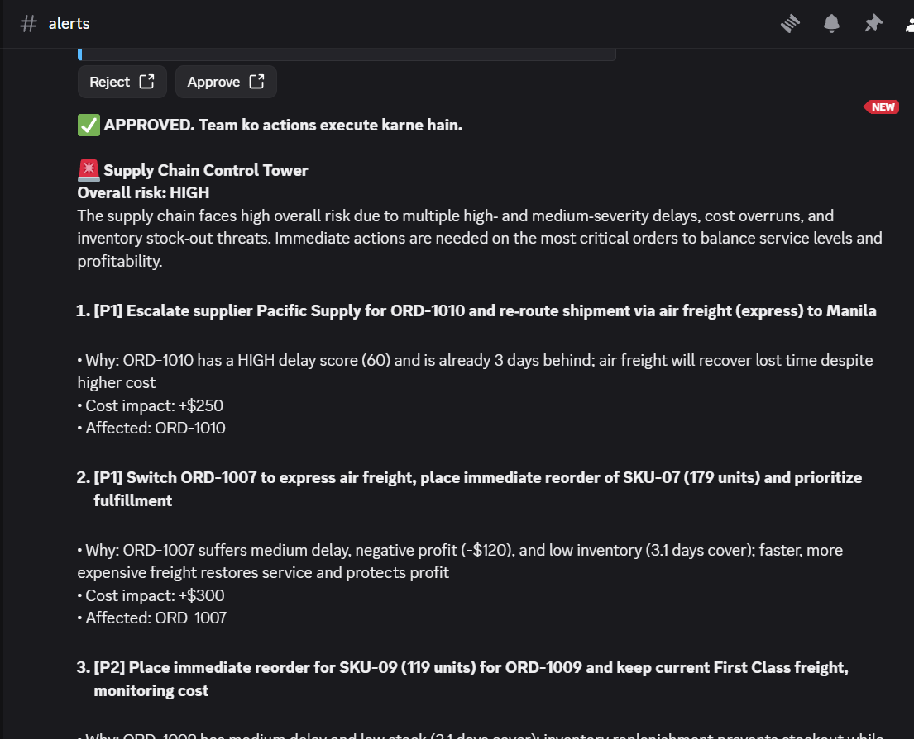
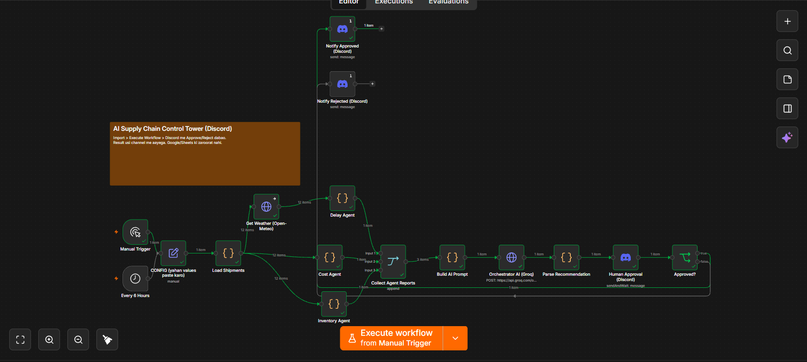
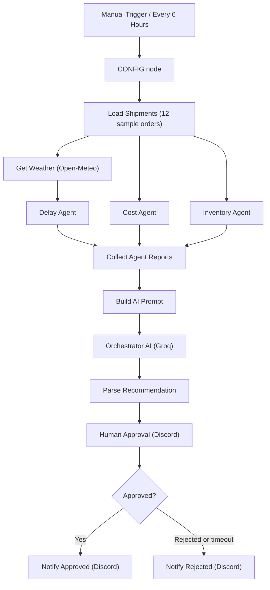

# AI Supply Chain Control Tower


A multi-agent, human-in-the-loop supply chain monitoring workflow built with **n8n**. Three specialist agents analyse shipments for delay, cost and inventory risk. An LLM orchestrator (Groq) resolves conflicts between them and proposes prioritised actions. A human approves or rejects the plan on **Discord** before anything is executed.

## Screenshots

### n8n Workflow



### Discord Approval



## Architecture



## How it works

1. **Triggers**: run manually, or automatically every 6 hours via the schedule trigger.
2. **Load Shipments**: loads shipment data (12 sample orders, DataCo-style, embedded in a Code node). Swap this node for Google Sheets, Postgres or an ERP query to use real data.
3. **Three agents run in parallel** on the same data (details below).
4. **Collect Agent Reports** merges the three reports into one payload.
5. **Orchestrator (Groq)** reads all reports, resolves trade-offs (for example, air freight fixes a delay but hurts cost) and returns 3 to 5 recommendations.
6. **Human approval on Discord**: the plan is posted to a channel with **Approve** and **Reject** buttons.
7. **Notification**: an approved plan is posted back as "APPROVED" with the full recommendation. A rejection or timeout is posted as "REJECTED" with the overall risk level.

### Delay Agent

Fetches a 2-day forecast per destination from [Open-Meteo](https://open-meteo.com/) (no API key needed) and scores every shipment from 0 to 100:

| Signal | Points |
| --- | --- |
| Already behind schedule (`days_in_transit - sched_days > 0`) | 20 + 8 per late day (max 40) |
| Heavy rain forecast (20 mm or more) | +25 |
| Rain forecast (10 to 20 mm) | +12 |
| Strong wind (50 km/h or more) | +15 |
| Supplier on-time rate below 80% | +15 |
| Standard Class shipping | +5 |

Score is capped at 100. **HIGH** is 60 or more, **MEDIUM** is 35 or more, otherwise **LOW**. The report contains counts, the average score and the top 5 risky shipments with reasons.

### Cost Agent

Flags orders where freight is more than **15% of order value** or profit is **negative**. The report contains total freight, total profit, average freight percentage and the top 5 flagged orders.

### Inventory Agent

Calculates days of cover (`stock / daily_demand`) and flags SKUs whose cover is shorter than the supplier lead time. It suggests a reorder quantity of `(lead_time + 7 days) x daily_demand - stock` and reports the 5 most urgent SKUs.

### Orchestrator (Groq)

Calls the Groq OpenAI-compatible chat completions API (default model `openai/gpt-oss-120b`, temperature 0.2, JSON output) and returns:

```json
{
  "overall_risk": "LOW | MEDIUM | HIGH",
  "summary": "2 sentences",
  "recommendations": [
    {
      "action": "...",
      "reason": "...",
      "priority": "P1 | P2 | P3",
      "cost_impact": "+$400",
      "affected": ["ORD-1001", "SKU-01"]
    }
  ]
}
```

## Input data format

Each shipment record has these fields:

`order_id`, `city`, `lat`, `lon`, `supplier`, `supplier_on_time`, `shipping_mode`, `sched_days`, `days_in_transit`, `order_value`, `freight_cost`, `profit`, `sku`, `stock`, `daily_demand`, `lead_time_days`

A ready-to-use copy of the 12 sample orders from the workflow is in `data/workflow_input_sample.csv`.

## Tech stack

- **n8n**: workflow orchestration (Code, HTTP Request, Merge, IF and Discord nodes)
- **Groq API**: LLM orchestrator
- **Open-Meteo**: free weather forecast API
- **Discord bot**: human approval and notifications

## Getting started

### Prerequisites

- n8n (self-hosted via Docker or `npx n8n`)
- A [Groq](https://console.groq.com) API key
- A Discord server where you can add a bot

### 1. Run n8n

```bash
docker run -it --name n8n -p 5678:5678 -v n8n_data:/home/node/.n8n docker.n8n.io/n8nio/n8n
```

Or: `npx n8n`. Then open http://localhost:5678.

### 2. Import the workflow

In n8n go to **Workflows > Import from file** and select `workflows/control-tower.json`.

### 3. Fill in the CONFIG node

Open the node named **CONFIG (yahan values paste karo)** and set:

| Field | Value |
| --- | --- |
| `groq_api_key` | Your Groq API key |
| `groq_model` | Groq model name (default `openai/gpt-oss-120b`) |
| `discord_guild_id` | Your Discord server ID |
| `discord_channel_id` | Channel where approvals are posted |

To copy IDs in Discord, enable **Developer Mode** (User Settings > Advanced), then right-click the server or channel and choose **Copy ID**.

### 4. Create the Discord bot credential

1. Create an application and bot in the [Discord Developer Portal](https://discord.com/developers/applications).
2. Invite the bot to your server with permission to view and send messages in the approval channel.
3. In n8n, create a **Discord Bot API** credential with the bot token and attach it to the three Discord nodes (the workflow expects one named `Discord Bot account`).

### 5. Run it

Click **Execute Workflow**, then press **Approve** or **Reject** in Discord.

## Notes

- The exported workflow is marked **active**, so the 6-hour schedule will start running as soon as it is imported and configured. Deactivate it if you only want manual runs.
- If n8n runs locally, the approval buttons link back to your n8n instance, so click them from the same machine or expose n8n with a public `WEBHOOK_URL`.
- The Discord message is trimmed to 1900 characters to stay under Discord's 2000-character limit.
- Never commit real API keys, bot tokens or Discord IDs. Use the placeholders in the workflow JSON.

## Project structure

```
workflows/   n8n workflow JSON
data/        sample CSV datasets (workflow_input_sample.csv matches the workflow, the others are illustrative)
docs/        screenshots
.env.example list of values you need to configure
```

## Ideas for extension

- Replace the sample Code node with Google Sheets, Postgres or an ERP integration
- Add Slack or email notifications alongside Discord
- Add a Supplier Risk agent or a demand-forecast agent
- Trigger automatic actions (purchase orders, carrier rebooking) after approval
- Log every run and decision to a database for audit

## License

MIT

